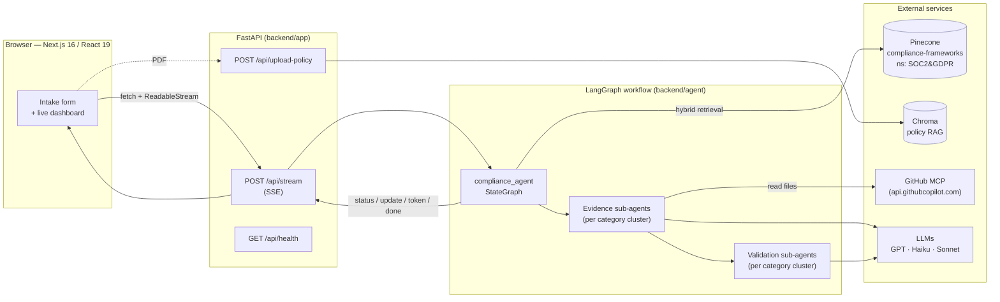
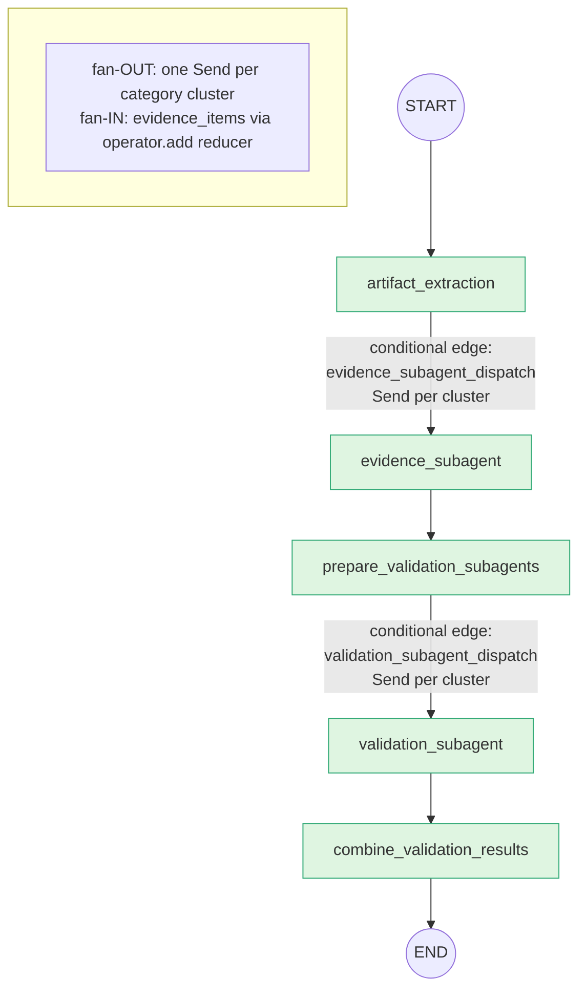
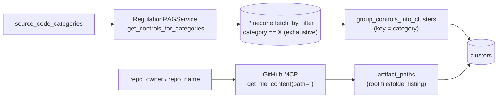
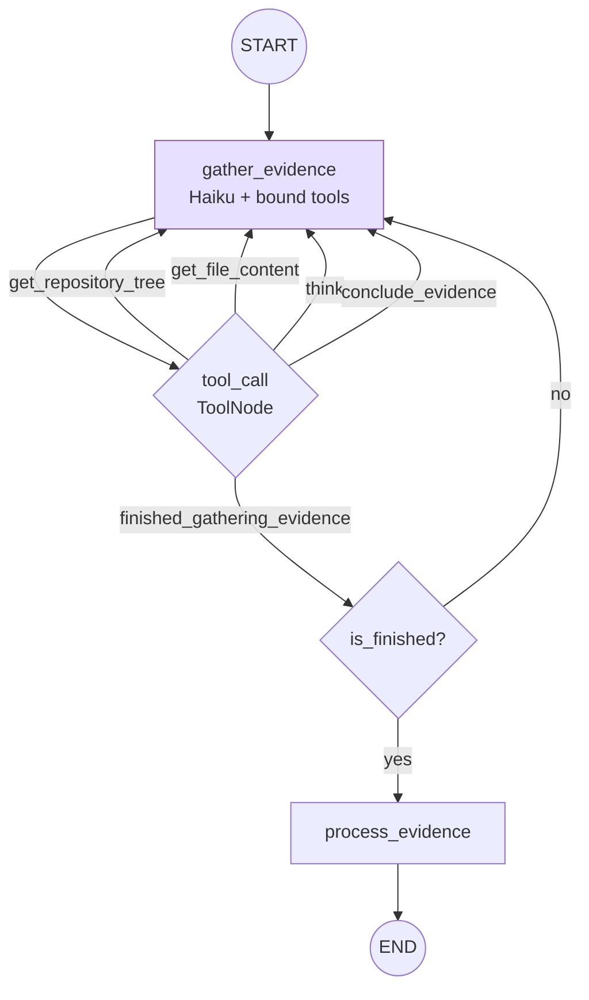
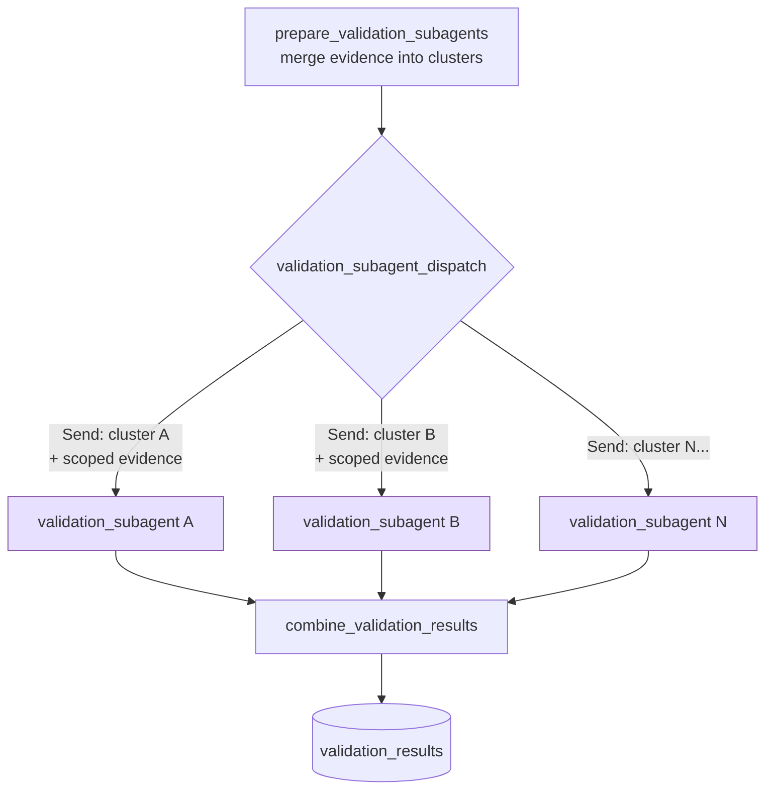
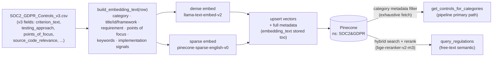

# Compliance Agent

An AI-powered compliance validation platform that assesses whether a GitHub repository satisfies regulatory controls. It combines the **SOC 2** and **GDPR** frameworks (surfaced in the UI as **"SOC 2 & GDPR"**) into a single control library, drives a **LangGraph multi-agent workflow** over the target repo's source code, and streams structured, evidence-grounded verdicts to a Next.js dashboard in real time over SSE.

The system does not "ask an LLM if the code is compliant." It runs a deliberately staged pipeline: it retrieves the exact controls in scope, fans out autonomous **evidence sub-agents** that read real source files under a strict tool budget, then fans out **validation sub-agents** that judge each control against only the evidence that was actually gathered — every `PASS`/`FAIL`/`PARTIAL` is tied to a verbatim code snippet.

---

## Table of Contents

- [What it does](#what-it-does)
- [System architecture](#system-architecture)
- [The compliance pipeline (LangGraph)](#the-compliance-pipeline-langgraph)
- [Stage 1 — Artifact extraction & control retrieval](#stage-1--artifact-extraction--control-retrieval)
- [Stage 2 — Evidence sub-agents (how the repo is scanned)](#stage-2--evidence-sub-agents-how-the-repo-is-scanned)
- [Stage 3 — Validation sub-agents (how verdicts are formed)](#stage-3--validation-sub-agents-how-verdicts-are-formed)
- [The control corpus & RAG ingestion](#the-control-corpus--rag-ingestion)
- [API layer & SSE streaming](#api-layer--sse-streaming)
- [Frontend](#frontend)
- [State model reference](#state-model-reference)
- [Quickstart](#quickstart)
- [Environment variables](#environment-variables)
- [Project layout](#project-layout)
- [Observability & evaluation](#observability--evaluation)

---

## What it does

A user picks a framework (SOC 2 & GDPR), selects one or more **scope categories**, points the tool at a GitHub repository (`owner/name`), and starts a run. The platform:

1. **Retrieves** every control belonging to the selected categories from a hybrid vector store.
2. **Lists** the target repository's files via the GitHub MCP server.
3. **Reads** the relevant source files autonomously — one evidence sub-agent per control category — and extracts verbatim code evidence.
4. **Validates** each control against its gathered evidence, producing a status, severity, calibrated confidence, per-point-of-focus assessment, and client-facing reasoning.
5. **Streams** progress and incremental results to the dashboard, which renders donut/severity charts, confidence rings, a filterable control explorer, and an evidence/reasoning detail panel.

### Scope categories

The 12 categories below map **exactly** to the `category` values in the control CSV. Retrieval is an exact-match metadata filter, so the frontend's `SCOPE_OPTIONS` and the CSV must stay in lockstep.

| SOC 2-leaning | GDPR-leaning |
|---|---|
| Logical and Physical Access Controls | Data Processing Principles |
| System Operations | Privacy by Design and Default |
| Change Management | Security of Processing |
| Risk Mitigation | Data Subject Rights |
| Availability | Breach Notification |
| Processing Integrity | PII Handling and Logging |

---

## System architecture



**Backend** — FastAPI app (`backend/app`) exposing SSE streaming + policy upload, wrapping a LangGraph `StateGraph` (`backend/agent`).
**Frontend** — Next.js app (`frontend`) that consumes the SSE stream and renders results incrementally.
**Stores** — Pinecone holds the regulation control corpus (hybrid dense + sparse vectors); Chroma holds uploaded policy documents for policy-RAG.
**Models** — tiered by cost/capability: GPT for policy steps, **Claude Haiku** for cheap extraction/evidence gathering, **Claude Sonnet** for final validation.

---

## The compliance pipeline (LangGraph)

The core is a `StateGraph` defined in `backend/agent/agent.py`, with node implementations in `nodes.py`. State flows through a single `ComplianceAgentState` TypedDict (`state.py`).



> **Note:** the graph also defines `extraction` and `policy_validation` nodes (policy-document RAG path), but their edges are commented out in `agent.py`. The **active path** is `START → artifact_extraction → evidence → prepare → validation → combine → END`. The pipeline is driven entirely by the **scope category list**, not a single dropdown value.

Two fan-out/fan-in phases define the workflow. Both use LangGraph's `Send` API to dispatch one parallel branch **per category cluster**:

- **Evidence phase** accumulates into `evidence_items`, an `operator.add`-reduced list (branches append; nothing is ever re-returned wholesale, or items would double).
- **Validation phase** accumulates into `validation_results`, also `operator.add`-reduced.

---

## Stage 1 — Artifact extraction & control retrieval

Node: `artifact_extractor_node` (`nodes.py`). This node runs two independent fetches **concurrently** (`asyncio.gather`):



1. **Control retrieval** — `get_controls_for_categories` issues, per selected category, a metadata-scoped Pinecone search (`{"category": {"$eq": category}}`) sized so **every** control in the category is returned and never truncated. This is exact-match and exhaustive (not top-k semantic search).
2. **Repo listing** — `GitHubMCPManager.get_file_content(path="")` returns the repo's root directory listing (files + folders) over the GitHub Copilot MCP endpoint. This becomes the `artifact_paths` navigation index handed to every evidence sub-agent.
3. **Clustering** — `group_controls_into_clusters` groups the retrieved controls into a `dict[str, list[control]]` keyed by `category`. Each control is normalized to `{regulation_id, title, requirement, points_of_focus}`. Unmatched controls fall into a `misc` bucket so nothing is silently dropped.

The node emits a `status` event (`get_stream_writer()`) so the UI shows "Extracting regulations and fetching `<repo>` root directory…".

---

## Stage 2 — Evidence sub-agents (how the repo is scanned)

This is the heart of the system. `evidence_subagent_dispatch` (a conditional edge) emits one `Send("evidence_subagent", …)` **per non-empty cluster**, each seeded with that cluster's controls, the full `artifact_paths` list, the repo coordinates, and a system + user message. Each `Send` runs an independent **sub-graph** — a small `StateGraph` compiled in `subagents.py`.

### The evidence sub-agent loop



The sub-agent is a Haiku model (`claude-haiku-4-5`) with five tools bound to it. It works through its **assigned controls one at a time**, and the loop is governed by an explicit, prompt-enforced **tool budget** to keep cost bounded and prevent it from spelunking the whole repo:

| Budget | Limit |
|---|---|
| `get_file_content` (global) | **8** calls across all controls |
| `get_repository_tree` (global) | **5** calls across all controls |
| `get_file_content` (per control) | **3** max |
| `get_repository_tree` (per control) | **2** max |

#### Tools

- **`get_repository_tree(owner, repo, path_filter, recursive)`** — explore a *subdirectory's* contents before fetching. Hard rule in the prompt: never call it on the repo root (the root listing is already provided as `artifact_paths`).
- **`get_file_content(owner, repo, path)`** — fetch a file's contents (or a directory listing). The primary evidence-gathering tool.
- **`think(evidence, code_snippets, finished, fetches_remaining, tree_calls_remaining)`** — a **no-op server-side checkpoint** the model must call immediately after every file fetch. It forces the model to externalize working memory — summarize what the file contained, capture verbatim snippets, and decrement its remaining budget — *before* context grows further. This is a deliberate context-engineering device, not a data tool.
- **`conclude_evidence(evidence_result)`** — records exactly one `EvidenceResult` for the current control, then the agent proceeds to the next. Called **exactly once per control**, even when nothing was found (`no_evidence_found=true`).
- **`finished_gathering_evidence()`** — called once, only after every assigned control has been concluded. This is the signal `is_finished` watches for to route to `process_evidence`.

#### Points of focus drive the search

Most controls carry **points of focus** — a set of behaviors that together describe what a complete implementation looks like. The prompt is explicit that these are **search context, not a checklist**: the sub-agent reads them together, infers the shared files/modules/keywords they imply, and runs **one unified search per control** rather than fanning out a search per point of focus. Points of focus that describe pure infrastructure/DevOps/third-party concerns are treated as signals about *where evidence may not exist in source* — not extra files to hunt down.

Each concluded control yields an `EvidenceResult`:

```python
EvidenceResult(
    regulation_id, title, requirement,
    files_searched=[...],        # paths the agent inspected
    code_snippets=[...],         # verbatim code relevant to the control
    description="...",           # plain-language summary of what evidence shows
    no_evidence_found=bool,
    points_of_focus_coverage=[   # one entry per point of focus
        PointOfFocusCoverage(point_of_focus=..., coverage="satisfied|partial|absent"),
    ],
)
```

The `process_evidence` node collects all concluded results from the message history and emits them. Back in the parent graph, `invoke_evidence_subagent` normalizes them and returns `{"evidence_items": [...]}` — appended via the `operator.add` reducer so results from all clusters merge into one list.

> **Why a separate "gather" model and strict budgets?** Evidence gathering is the high-volume, high-token phase. Running it on cheap Haiku with hard fetch caps and a forced `think` checkpoint keeps a full multi-category run affordable and bounded, while still producing the verbatim snippets the (more expensive) validation stage needs.

---

## Stage 3 — Validation sub-agents (how verdicts are formed)

Between evidence and validation, `prepare_validation_subagents` merges the gathered evidence back onto the cluster structure (`update_clusters_with_evidence`, matching by `regulation_id`). It deliberately does **not** re-return `evidence_items` — doing so would re-trigger the `operator.add` reducer and double every item.

Then `validation_subagent_dispatch` fans out again — one `Send("validation_subagent", …)` per cluster — but this time each branch is scoped to **only the evidence whose `regulation_id` belongs to that cluster's controls**:



Each validation sub-agent is **Claude Sonnet** (`claude-sonnet-4-6`) constrained to **structured output** — it must return a `ValidationBatch` containing one `ControlValidation` per evidence item. `invoke_validation_subagent` invokes the model, parses/validates the structured response (with fallbacks for stringified JSON), streams an `updates` event, and returns the batch. `combine_validation_results` flattens all batches into the final `validation_results`.

### What a validation produces

```python
ControlValidation(
    regulation_id, title,
    status="PASS" | "FAIL" | "PARTIAL" | "NO_EVIDENCE",
    severity="critical|high|medium|low" | None,   # null for PASS / NO_EVIDENCE
    confidence=0.0..1.0,                            # calibrated float
    confidence_label="High|Medium|Low|Inconclusive",
    findings=[ValidationFinding(...)],             # >= 1, each tied to evidence
    points_of_focus=[PointOfFocusAssessment(...)], # one per point of focus
    overall_reasoning="client-facing summary",
)
```

Design choices that keep verdicts honest and grounded:

- **Findings must cite evidence.** Each `ValidationFinding` is typed `violation | pass | gap`, and `pass`/`violation` findings require an `evidence_ref` — a **verbatim** excerpt (≤200 chars) from the gathered snippets. Only `NO_EVIDENCE` gaps may omit it. The validator cannot pass or fail a control without pointing at code.
- **Point-of-focus level assessment.** Each point of focus gets its own status (`satisfied | partial | absent | not_applicable`). `not_applicable` exists specifically so the validator can mark a behavior as enforced *outside the codebase* (infra/DevOps/third-party) rather than penalizing its absence from source.
- **Severity only where it means something.** Severity is null for `PASS`/`NO_EVIDENCE` and required for `FAIL`/`PARTIAL`.
- **Evidence is scoped, not global.** A validator only ever sees the evidence for its own cluster's controls, keeping each judgment focused and the context small.

---

## The control corpus & RAG ingestion

The regulation library lives in **Pinecone** (index `compliance-frameworks`, namespace `SOC2&GDPR`), seeded from `backend/agent/scripts/SOC2_GDPR_Controls_v3.csv` by `data_ingestion.py`.



### Composite embedding text

Rather than embedding `criterion_text` alone, ingestion composes a natural-language **"control document"** per row via `build_embedding_text` — stitching together the category, the title/id/framework, the requirement, points of focus, keywords, and implementation signals. *That* composite string is what gets embedded (both dense and sparse), and it's **also stored as `embedding_text` metadata** so the reranker (`bge-reranker-v2-m3`) judges controls on the same surface that was embedded. This makes retrieval and reranking consistent.

### Two retrieval paths

- **`get_controls_for_categories`** — the pipeline's primary path. The caller already knows which categories it wants, so selection is a **metadata filter**, returning *every* control in those categories (`PineconeClient.fetch_by_filter`, `top_k` sized above the largest category so nothing is dropped). Pinecone serverless requires a vector even for a metadata-scoped fetch, so one is passed for ordering only.
- **`query_regulations`** — free-text hybrid semantic search + rerank, for when selection is content-driven rather than category-driven.

### Single source of truth

`REGULATION_NAMESPACE = "SOC2&GDPR"` lives in `regulation_rag_service.py` and is imported by **both** ingestion and retrieval, keeping the namespace in lockstep and decoupled from the free-text `framework` label. `format_regulation_results` maps the CSV's v3 field names (`criterion_text`, `testing_approach`, `evidence_indicators`) back to stable internal keys (`requirement`, `testing_criteria`, `evidence_indicator`) so downstream code is insulated from the schema.

To (re)seed the corpus:

```bash
cd backend && source .venv/bin/activate
python agent/scripts/data_ingestion.py
```

---

## API layer & SSE streaming

`backend/app/main.py` builds the FastAPI app (CORS allows `localhost:3000`); `api.py` defines the routes.

| Route | Purpose |
|---|---|
| `POST /api/stream` | Run the workflow; stream **SSE** events. |
| `POST /api/upload-policy` | Ingest a policy **PDF** into Chroma (validates the `%PDF-` magic header). |
| `GET /api/health` | Liveness probe → `{"status": "ok"}`. |

`/api/stream` consumes the request `{framework, category, source_code_categories, repo_owner, repo_name}`, overrides the singular `category` with `source_code_categories[0]` (the pipeline is scope-list-driven), and calls `compliance_agent.astream(..., stream_mode=["custom", "updates"])`. It wraps the run in a Braintrust span and serializes each chunk as a Server-Sent Event.

**SSE event types** emitted to the client:

| `type` | Meaning |
|---|---|
| `status` | Human-readable progress message (e.g. "Gathering evidence…"). |
| `update` | Incremental graph state update (LangGraph `updates` mode). |
| `token` | Streamed token output. |
| `error` | Friendly, classified failure (rate-limit / repo-not-found / timeout / generic). |
| `done` | Terminal success marker. |

Errors are run through `_format_stream_error`, which classifies the raw exception into user-friendly guidance rather than leaking stack traces.

---

## Frontend

A Next.js 16 / React 19 app (`frontend/src`). **Note:** this is a *non-standard* Next.js setup — see `frontend/AGENTS.md` and consult `node_modules/next/dist/docs/` before using Next.js APIs.

- **`app/page.tsx`** — orchestrates a run. It `fetch`es `POST /api/stream` and reads the response as a streaming `ReadableStream`, parsing SSE frames and updating component state incrementally. API base URL comes from `NEXT_PUBLIC_API_BASE_URL` (default `http://127.0.0.1:8000`).
- **`components/compliance/`**
  - `screens.tsx` — the intake form. Holds `FRAMEWORKS` (`["SOC2&GDPR"]`) and `SCOPE_OPTIONS` (the 12 categories). **`SCOPE_OPTIONS` must match the CSV `category` values exactly**, or retrieval returns nothing for the mismatched scope.
  - `results.tsx` — the results dashboard.
  - `charts.tsx` — donut charts, severity mix, confidence rings.
  - `primitives.tsx`, `Icon.tsx` — UI building blocks.

The UI renders a filterable control explorer and a reasoning/evidence detail panel, updating live as `status` and `update` events arrive.

---

## State model reference

`ComplianceAgentState` (`state.py`) is the shared graph state. Key fields:

| Field | Type | Role |
|---|---|---|
| `framework` | `str` | Free-text framework label (e.g. `SOC2&GDPR`). |
| `category` | `str` | Overridden to `source_code_categories[0]`. |
| `source_code_categories` | `list[str]` | The scope list that actually drives the run. |
| `regulations` | `list[dict]` | Retrieved controls (raw fields). |
| `clusters` | `dict[str, list[dict]]` | Controls grouped by category; later enriched with evidence. |
| `artifact_paths` | `list[str]` | Repo root listing handed to evidence sub-agents. |
| `evidence_items` | `list[EvidenceResult]` *(reducer: `operator.add`)* | Accumulated evidence across clusters. |
| `validation_results` | `list[ControlValidation]` *(reducer: `operator.add`)* | Final verdicts. |
| `repo_owner` / `repo_name` | `str` | Target repository coordinates. |

`SubAgentInput` is the per-branch state for evidence sub-agents (`messages`, `cluster_id`, `controls`, `artifact_paths`, `priority_paths`, repo coords, and an `operator.add`-reduced `evidence_results`).

---

## Quickstart

> Requires Python 3.11+, Node 18+, and accounts/keys for OpenAI, Anthropic, Pinecone, and a GitHub PAT. See [Environment variables](#environment-variables).

**Backend**

```bash
cd backend
python -m venv .venv && source .venv/bin/activate
pip install -r requirements.txt
# create backend/.env (see below), then seed the control corpus once:
python agent/scripts/data_ingestion.py
uvicorn app.main:app --reload --port 8000
curl http://localhost:8000/api/health      # {"status":"ok"}
```

**Frontend**

```bash
cd frontend
npm install
npm run dev        # http://localhost:3000
```

Open `http://localhost:3000`, choose **SOC 2 & GDPR**, tick one or more scope categories, enter a repo `owner` and `name`, and start the review.

---

## Environment variables

Create `backend/.env`:

| Variable | Purpose |
|---|---|
| `OPENAI_API_KEY` | GPT model for the (optional) policy extraction/validation path. Also required if you point a sub-agent at an `openai:` model. |
| `ANTHROPIC_API_KEY` | Claude Haiku (evidence) + Sonnet (validation) sub-agents. |
| `PINECONE_API_KEY` | Hybrid vector search + reranking of the control corpus. |
| `GITHUB_PERSONAL_ACCESS_TOKEN` | Repo file/tree retrieval via the GitHub MCP server. |
| `LANGSMITH_API_KEY` / `LANGSMITH_ENDPOINT` | Tracing (optional). |
| `CHROMA_PERSIST_DIR` | Local Chroma path for policy-document RAG (default `./chroma_db`). |

**Configurable sub-agent models** — both sub-agent stages accept a `provider:model` string (resolved by LangChain's `init_chat_model`), so you can switch providers without touching code. Make sure the matching provider key above is set.

| Variable | Default | Controls |
|---|---|---|
| `EVIDENCE_SUBAGENT_MODEL` | `anthropic:claude-haiku-4-5` | The evidence-gathering sub-agent (Stage 2). |
| `VALIDATION_SUBAGENT_MODEL` | `anthropic:claude-sonnet-4-6` | The validation sub-agent (Stage 3). |

```bash
# Example: run both sub-agents on GPT instead of Claude
EVIDENCE_SUBAGENT_MODEL="openai:gpt-5.4-mini"
VALIDATION_SUBAGENT_MODEL="openai:gpt-5.4-mini"
```

> The evidence sub-agent binds tools and the validation sub-agent uses structured output — pick models that support tool calling / structured output when overriding.

Frontend reads `NEXT_PUBLIC_API_BASE_URL` (default `http://127.0.0.1:8000`).

---

## Project layout

```
compliance-agent/
├── backend/
│   ├── app/
│   │   ├── main.py                 # FastAPI app + CORS
│   │   └── api.py                  # /stream (SSE), /upload-policy, /health
│   ├── agent/
│   │   ├── agent.py                # LangGraph StateGraph wiring
│   │   ├── nodes.py                # pipeline nodes + model tiers + dispatch edges
│   │   ├── subagents.py            # evidence sub-agent sub-graph
│   │   ├── subagent_nodes.py       # gather / process evidence nodes
│   │   ├── tools.py                # think, conclude_evidence, finished_gathering_evidence
│   │   ├── clusters.py             # grouping + evidence-merge logic
│   │   ├── prompts.py              # sub-agent system prompts (budgets, points of focus)
│   │   ├── state.py                # ComplianceAgentState + Pydantic result models
│   │   ├── core/                   # pinecone / chroma / openai clients
│   │   ├── utils/                  # regulation & policy RAG services, GitHub MCP manager
│   │   └── scripts/                # data_ingestion.py + SOC2_GDPR_Controls_v3.csv
│   ├── evals/                      # budget adherence eval
│   └── requirements.txt
├── frontend/                       # Next.js 16 dashboard (see frontend/AGENTS.md)
└── CLAUDE.md / AGENTS.md           # contributor guidance
```

---

## Observability & evaluation

- **Braintrust** spans wrap the top-level run (`compliance_run`) and individual nodes (`@braintrust.traced`), logging framework/category/repo inputs and completion/error status.
- **LangSmith** tracing is supported via the `LANGSMITH_*` env vars.
- **Evals** — `backend/evals/budget_adherence_eval.py` checks that evidence sub-agents respect their tool budgets, the central cost-control invariant of the system.

---

*Built with LangGraph, FastAPI, Pinecone, Chroma, the GitHub MCP server, Claude (Haiku/Sonnet), GPT, and Next.js.*
